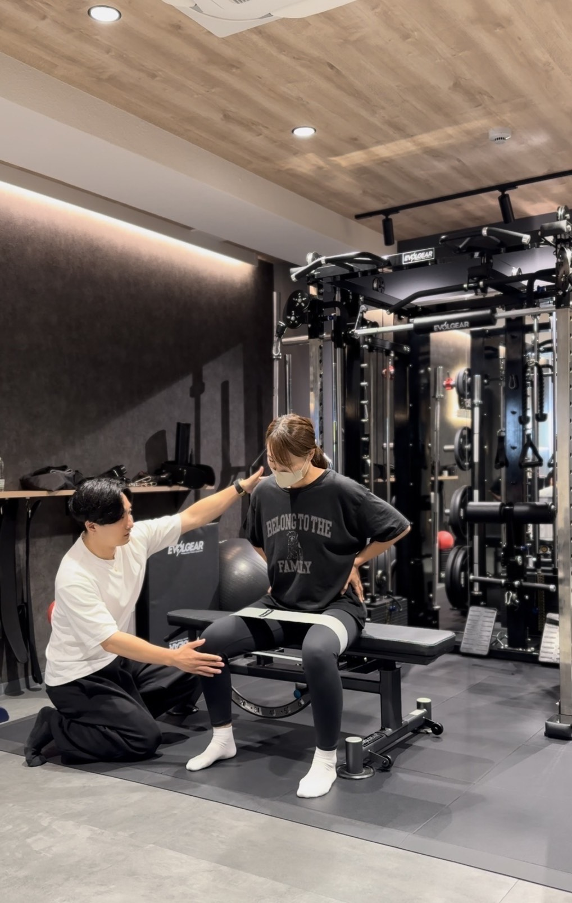

# Noguchi Ryo Personal Training - ランディングページ

パーソナルトレーニングサービスのランディングページ

## 📁 ファイル構成

```
/
├── index.html              # メインHTMLファイル
├── css/
│   └── style.css          # スタイルシート
├── js/
│   └── main.js            # JavaScript
├── image/                 # 画像ファイル
│   ├── Profile_img.jpeg   # プロフィール写真
│   ├── price_1.jpeg       # 60分プラン料金表
│   ├── price_2.jpeg       # 90分プラン料金表
│   └── training_*.jpeg    # トレーニング風景（8枚）
├── requirements.md        # 要件定義書
└── README.md             # このファイル
```

## 🚀 使い方

### ローカルで確認する方法

1. **ファイルをダウンロード**
   - このフォルダ全体をローカル環境に配置

2. **ブラウザで開く**
   - `index.html` をダブルクリックしてブラウザで開く
   - または、以下のコマンドでローカルサーバーを起動（推奨）

```bash
# Pythonがインストールされている場合
python -m http.server 8000

# または
python3 -m http.server 8000

# Node.jsがインストールされている場合
npx http-server -p 8000
```

ブラウザで `http://localhost:8000` にアクセス

## ✅ 完成している機能

- ✅ レスポンシブデザイン（PC、タブレット、スマートフォン対応）
- ✅ スムーススクロール
- ✅ ハンバーガーメニュー（モバイル）
- ✅ セクションごとのアニメーション
- ✅ 各セクションの実装
  - ファーストビュー
  - コンセプト
  - サービス紹介
  - トレーナープロフィール
  - お客様の声（4件）
  - 料金プラン（60分・90分）
  - お問い合わせ
  - フッター

## ⚠️ 今後の対応が必要な項目

### 1. Googleフォームの埋め込み

**ファイル:** `index.html`（335行目付近）

```html
<!-- TODO: GoogleフォームのURLを設定してください -->
<div class="contact-form-area">
    <p class="contact-placeholder">こちらにGoogleフォームを埋め込んでください</p>
    <!-- <iframe src="GoogleフォームのURL" width="100%" height="800" frameborder="0" marginheight="0" marginwidth="0">読み込んでいます…</iframe> -->
</div>
```

**対応方法:**
1. Googleフォームを作成
2. フォームの「送信」→「<>」（埋め込みコード）を取得
3. 上記の`<iframe>`タグのコメントを外し、URLを設定
4. `<p class="contact-placeholder">...</p>` を削除

### 2. SNSリンクの追加

**ファイル:** `index.html`（356-363行目付近）

```html
<!-- TODO: InstagramとアパレルサイトのURLを後日追加 -->
<a href="#" class="social-link" aria-label="Instagram" target="_blank" rel="noopener noreferrer">
    <i class="fab fa-instagram"></i>
</a>
<a href="#" class="social-link" aria-label="Website" target="_blank" rel="noopener noreferrer">
    <i class="fas fa-tshirt"></i>
</a>
```

**対応方法:**
1. `href="#"` の部分を実際のURLに変更
   - Instagram: `href="https://instagram.com/あなたのアカウント"`
   - アパレルサイト: `href="https://あなたのサイトURL"`

### 3. ファビコンの設定（任意）

**ファイル:** `index.html`（head内に追加）

```html
<link rel="icon" type="image/png" href="favicon.png">
```

## 🎨 カスタマイズ方法

### カラースキームを変更する

**ファイル:** `css/style.css`

主要な色を一括で変更できます：

```css
/* メインカラー（青） */
#3498db → お好みの色コードに変更

/* テキストカラー（ダークグレー） */
#2c3e50 → お好みの色コードに変更

/* 背景カラー（ライトグレー） */
#f8f9fa → お好みの色コードに変更
```

### フォントを変更する

**ファイル:** `index.html`（11-13行目）

```html
<link href="https://fonts.googleapis.com/css2?family=Noto+Sans+JP:wght@300;400;500;700;900&display=swap" rel="stylesheet">
```

Google Fontsで別のフォントを選んで、このリンクを変更してください。

### セクションの順序を変更する

`index.html` 内の `<section>` タグをコピー＆ペーストで自由に並び替えられます。

### トレーニング風景の画像を変更する

**ファイル:** `index.html`（51行目）

```html

```

`training_1.jpeg` を他の画像ファイル名に変更できます。

## 🌐 公開方法

### 推奨ホスティングサービス（無料）

#### 1. **Netlify**（最も簡単）
1. [Netlify](https://www.netlify.com/) にアクセス
2. GitHubアカウントでサインアップ
3. ドラッグ&ドロップでフォルダをアップロード
4. 自動的にURLが発行される

#### 2. **GitHub Pages**
1. GitHubリポジトリを作成
2. ファイルをプッシュ
3. Settings → Pages → ブランチを選択して保存
4. `https://ユーザー名.github.io/リポジトリ名/` でアクセス可能

#### 3. **Vercel**
1. [Vercel](https://vercel.com/) にアクセス
2. GitHubアカウントでサインアップ
3. リポジトリをインポート
4. 自動的にデプロイ

### 独自ドメインの設定

上記のサービスはすべて独自ドメインの設定が可能です。
各サービスのドキュメントを参照してください。

## 📱 動作確認

### 確認済みブラウザ

- Chrome（最新版）
- Firefox（最新版）
- Safari（最新版）
- Edge（最新版）

### レスポンシブ対応

- PC（1200px以上）
- タブレット（768px〜1024px）
- スマートフォン（〜768px）

### 動作確認項目

- [ ] すべてのリンクが正しく動作する
- [ ] ハンバーガーメニューが開閉する（モバイル）
- [ ] スムーススクロールが機能する
- [ ] 画像が正しく表示される
- [ ] Googleフォームが表示される
- [ ] SNSリンクが正しく動作する
- [ ] レスポンシブデザインが適切に表示される


---

**作成日:** 2025-10-29
**バージョン:** 1.0
